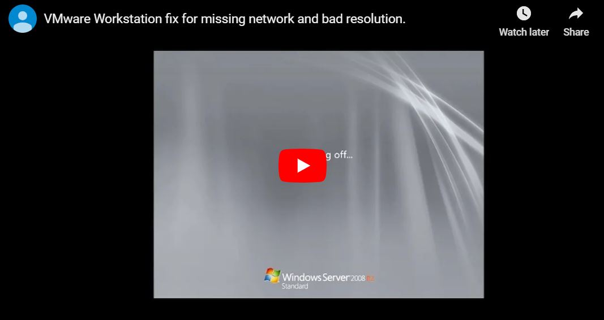

These are common issues I have encountered when importing virtual machines from online courses, vulnhub, VirtualBox, etc. 

## No network connection available after importing vm... 

You received a shiny new vulnerable vm and want to try it out but when you spin it up, it can't connect to the network. 

## <u>Install VMware Tools</u> 

But sometimes the VMware tools option is grayed out. Here's what to do: 

1. Turn off the virtual machine. 
2. Right click on your virtual machine and select settings.
3. Click on the options tab. 
4. Select General and switch it from `Other` to `Microsoft Windows`, and select your OS version.
5. Click ok and turn your vm back on. 

You might need to add a CD-ROM drive: 

On VMware Workstation, right click on the virtual machine and click settings. 
Click on the Hardware tab and check if you have a CDROM drive. Otherwise click on `add` and select CD/DVD.

Click Finish

If you get an error message such as `cannot connect teh virtual  device... ` click yes and continue with the following step.

Start your vm and log in. Then on top menu of VMware Workstation select 'VM' -> 'Install VMware Tools'. 

Follow the prompts and restart the computer .

Watch this video for more information: 

(https://www.youtube.com/watch?v=-cQGE7HwRxE)

