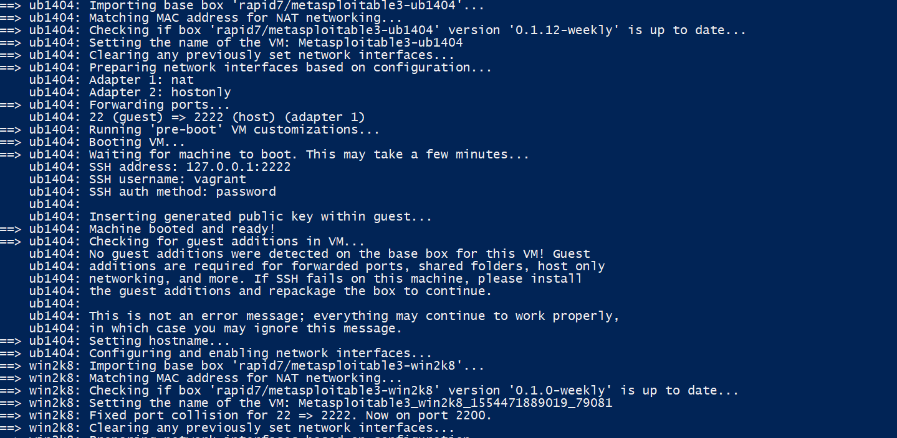
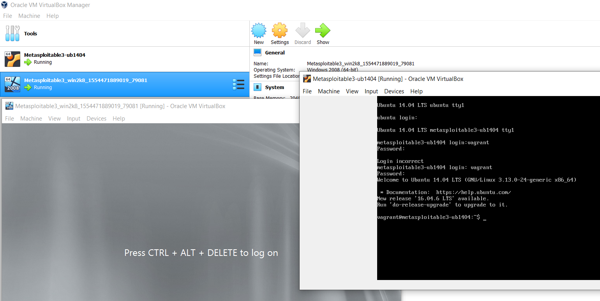
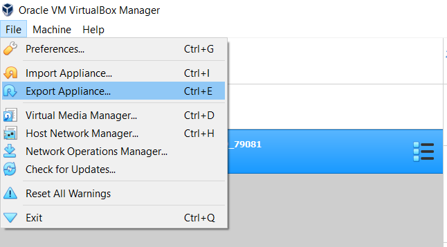
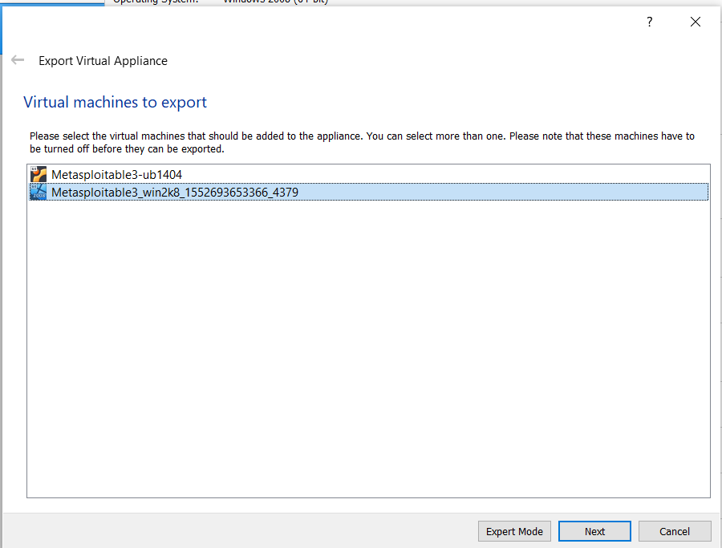
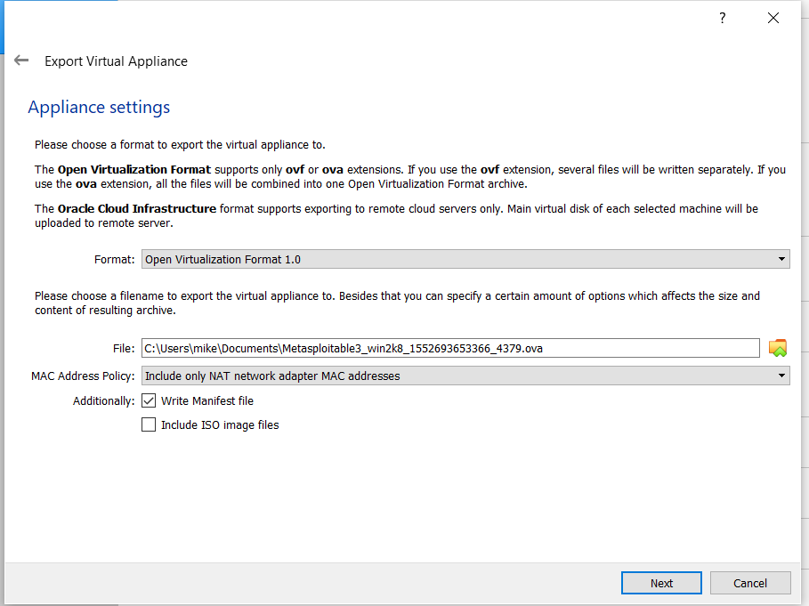
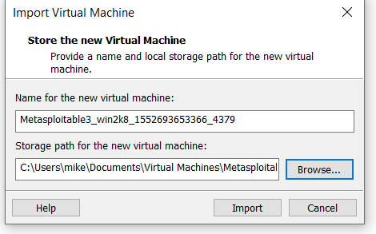
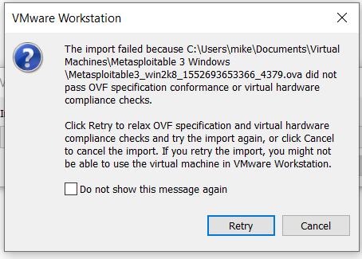
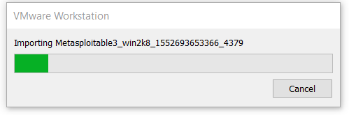
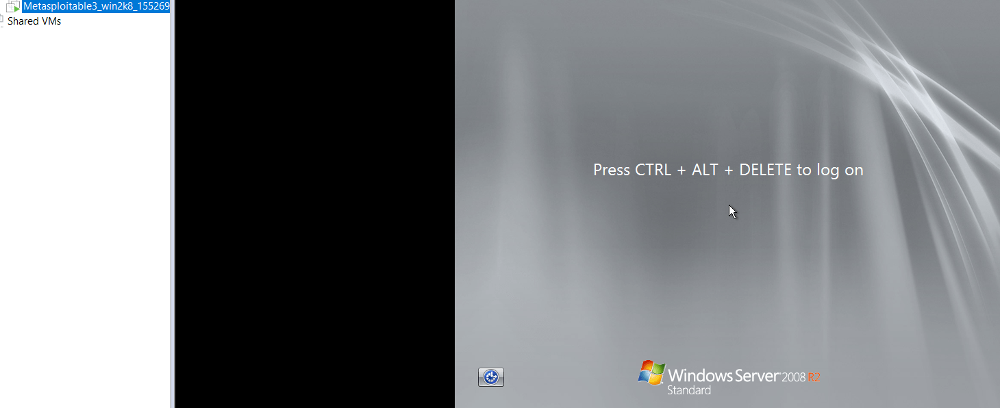

:warning: **UPDATE:** *6/25/2020 - If you have bought a license for the VMWare provider for Vagrant - Go to my new post: <a href="https://michaelnieto.com/vmware-vagrant-provider/"
target="_blank">https://michaelnieto.com/vmware-vagrant-provider/</a>. 
The VMWare provider from Vagrant allows building Metasploitable 3 directly into VMWare Workstation Pro.*

:arrow_right: **Continue reading if you want to use VirtualBox for free.** 

Metasploitable3 is a virtual machine that is built from the ground up with a large amount of security vulnerabilities. For detailed information, [click here to view its repository.](https://github.com/rapid7/metasploitable3)

Configuring the virtual machine is a little tricky so I've documented the fastest way I was able to get it running on VirtualBox and VMware Workstation for free. 

# Prereqs 


**Download and install Vagrant:**   

[https://www.vagrantup.com/downloads.html](https://www.vagrantup.com/downloads.html) - Vagrant is an open-source software product for building and maintaining portable virtual software development environments.. [More Info...](https://en.wikipedia.org/wiki/Vagrant_(software))


**Download and install VirtualBox:**

<a href="https://www.virtualbox.org/" target="_blank">https://www.virtualbox.org/</a> - VirtualBox is an open-source hypervisor from Oracle that can be used to host virtual machines. Vagrant uses it to create the virtual machine and run all the necessary scripts.  


**Download the Vagrantfile**

1.  Create an empty folder. You can name it `metasploitable3`.
2.  [Right-click this link and choose “Save Link As” to save the "Vagrantfile"](https://raw.githubusercontent.com/rapid7/metasploitable3/master/Vagrantfile).
3. Save the Vagrantfile to the folder you created `metasploitable3`

4. Make sure the file's name is Vagrantfile without .txt
5. Open the file and confirm it has the configuration data. You can edit the file but at this point it's not necessary.  

The file should begin like this: 
```ruby
# -*- mode: ruby -*-
# vi: set ft=ruby :

Vagrant.configure("2") do |config|
  config.vm.synced_folder '.', '/vagrant', disabled: true
  config.vm.define "ub1404" do |ub1404|
    ub1404.vm.box = "rapid7/metasploitable3-ub1404"
    ub1404.vm.hostname = "metasploitable3-ub1404"
    config.ssh.username = 'vagrant'
    config.ssh.password = 'vagrant'
```
6. While in the same folder, hold down the shift key and right click on the empty space below your file and select `Open PowerShell window here`. Alternatively you can just open Powershell and change directories until you are in `metasploitable3` folder. 
7. Type the following command: `vagrant up`
8. Vagrant will download and configure the Linux and Windows images. 

Powershell should look like this: 


9. Open VirtualBox and your virtual machines should be running. 
Both machines use the following creds. 
Username: vagrant
Password: vagrant



At this point you can use your virtual machines but I prefer to use VMWare Workstation Pro. 

# How to transfer your virtual machines to VMWare Workstation Pro

**Export from VirtualBox**

1. Turn off your virtual machines running in Virtual Box. 
2. Click on File -> Export Appliance. 

3. Select the vm you want to export first. 

4. Select the folder where you'd like to save the vm and select Next. 

5. When finished, you should have an .ova file. 

**Import into VMWare Workstation Pro**

1. Locate your exported .ova file and right click on it and select "Open with VMWare Workstation". 
2. Select a location where you want to save your vm and click import. 

3. If you get an error message, select `Retry`

4. The import process takes some time. Approximately 5 to 10 minutes on a new computer.  

5. Hack the planet!



