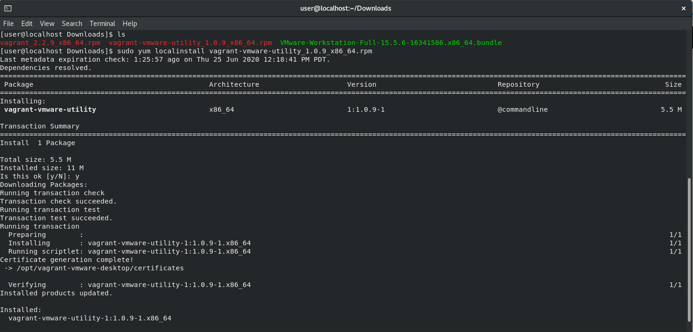
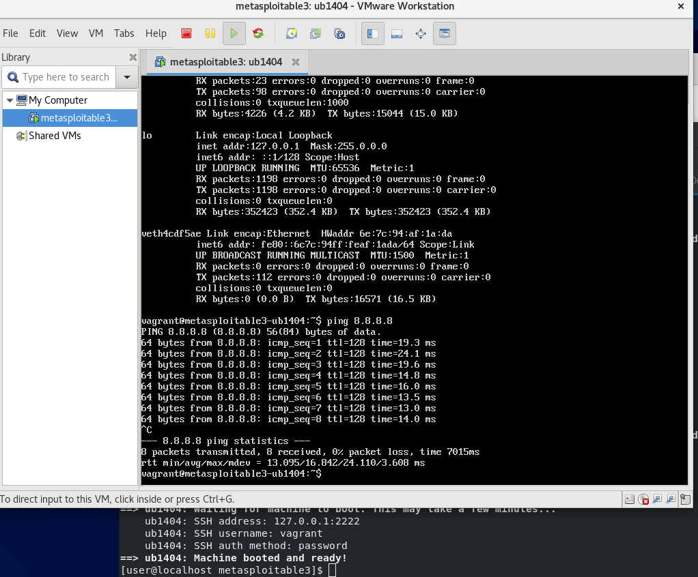
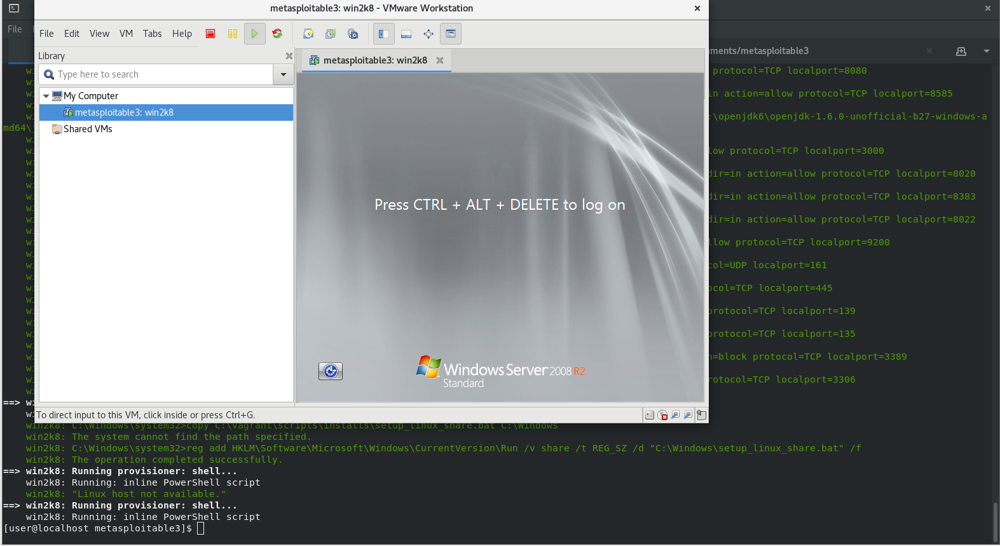

How to setup the Vagrant VMware provider with a paid license to work on VMware Workstation Pro 15.5 running on CentOS 8. 

Thanks to **Aaron McKay** for encouraging me to write this post and providing the Vagrant VMware provider license. 

**On this post I will show you how to:** 

1. Install VMware Workstation Pro.
2. Install Vagrant.
3. Install the Vagrant VMware Utility.
4. Install the Vagrant VMware Plugin.
5. Install the Vagrant VMware Provider License.
6. Provision a machine (Metasploitable 3 Win 2k8 and Linux versions).

First let's begin with how to install VMware Workstation Pro 15.5 on CentOS 8 / RHEL. Skip ahead if you already have it installed. 

**Install VMware Workstation Pro.** 

1. Download the installer: <a href="https://www.vmware.com/products/workstation-pro/workstation-pro-evaluation.html" target="_blank">https://www.vmware.com/products/workstation-pro/workstation-pro-evaluation.html</a>

2. Locate the .bundle file and run the following commands:   
3. Make it executable with `chmod +x VMware-Workstation...` The full command depends on your version.  
4. Run the installer with `sudo ./VMware.Workstation...`
5. You'll receive a message saying the installation was successful. 


6. Open VMware workstation from the application menu or type `vmware` in your terminal.

**Common Issue:** `Before you can run VMware, several modules must be compiled and loaded into the running kernel.` fails when you click Install. 


1. If the modules fail to install, try running this command:   
`sudo dnf install elfutils-libelf-devel` more information can be found here: [https://kb.vmware.com/s/article/58533](https://kb.vmware.com/s/article/58533)
2. Then launch VMware Workstation Pro 15.5 again and click install on the VMware Kernel Module Updater. This time it should complete. 
3. Once the program opens completely, install your license and try building an empty virtual machine to make sure everything works. 

**Install Vagrant.**

1. Download the Vagrant CentOS package from <a href="https://www.vagrantup.com/downloads" target="_blank">https://www.vagrantup.com/downloads</a>.
2. Locate the .rpm file you downloaded and run the following command:   
`sudo yum localinstall vagrant_2.2.9_x86_64.rpm` your version may be different. 
3. Type y and hit enter if prompted. 
4. Type `vagrant` and hit enter in your terminal and you should see the Vagrant's help options. 

**Install Vagrant's VMware Utility**

1. Download the CentOS rpm package from `https://www.vagrantup.com/vmware/downloads`. 
2. Locate the .rpm file and run the following command:   
`sudo yum localinstall vagrant-vmware-utility_1.0.9_x86_64.rpm` your version or file name might be different. 
3. Type y and hit enter if prompted. 
4. You should see the messages "Certificate generation complete!" and a successful installation message.   



**Install the Vagrant VMware Plugin**

1. Make sure you installed the Vagrant VMware Utility successfully from the previous steps. 
2. Run the following command:   
`vagrant plugin install vagrant-vmware-desktop`
3. You should receive a green message "Installed the plugin..."

**Install the Vagrant VMware plugin license**

1. Download your license file. It should be named license.lic. 
2. Go to the directory where you download the file and run the following command: 
`vagrant plugin license vagrant-vmware-desktop licnese.lic`
3. You should receive a green message that says "vagrant-vmware-desktop was successfully installed!"


 
 4. Lastly run this command to make sure the service is installed:
 
`sudo /opt/vagrant-vmware-desktop/bin/vagrant-vmware-utility service install`  

**Common Issue:** This also fixes a common issue when provisioning a machine and you receive the error message "Vagrant encountered an unexpected communications error with the Vagrant VMware Utility driver..."


**Provisioning a virtual machine**

In this example I'm going to provision Metasploitable 3 from Vagrant using the Vagrant VMware Utility. 

1. You can find the original instructions here <a href="https://github.com/rapid7/metasploitable3" target="_blank">https://github.com/rapid7/metasploitable3</a>
The vagrant file provided is meant to work with Virtualbox. If you are using Virtualbox only go to my other post:
<a href="https://michaelnieto.com/metasploitable-3/" target="_blank">https://michaelnieto.com/metasploitable-3/</a>

2. Download my customized vagrant file for each machine you want: 

If you want the Metasploitable Win 2k8 machine, download the following Vagrantfile: 
<a href="https://github.com/mikensec/mikensec.github.io/tree/master/assets/vagrant/windows/Vagrantfile" target="_blank">https://github.com/mikensec/mikensec.github.io/tree/master/assets/vagrant/windows/Vagrantfile</a>


For the Metaploitable 3 Linux image <a href="https://github.com/mikensec/mikensec.github.io/tree/master/assets/vagrant/linux/Vagrantfile" target="_blank">https://github.com/mikensec/mikensec.github.io/tree/master/assets/vagrant/linux/Vagrantfile</a>

3. You can also run the following commands in your terminal: 

For the Win 2k8 Vagrantfile: 

```bash
mkdir metasploitable3-windows-workspace
cd metasploitable3-windows-workspace
curl -O https://raw.githubusercontent.com/mikensec/mikensec.github.io/master/assets/vagrant/windows/Vagrantfile
```

For the Linux Vagrantfile: 

```bash
mkdir metasploitable3-linux-workspace
cd metasploitable3-linux-workspace
curl -O https://raw.githubusercontent.com/mikensec/mikensec.github.io/master/assets/vagrant/linux/Vagrantfile
```
4. Then go into the workspace you want to use for example:   

```bash
cd metasploitable3-windows-workspace
vagrant up --provider=vmware_desktop
```

5. Once your image is provisioned, VMware Workstation will open up. 





If you receive an error message about Vagrant encountered and unexpected communications error...


Try this command: 

`sudo /opt/vagrant-vmware-desktop/bin/vagrant-vmware-utility service install`

Other possible error messages can come up if you don't have enough disk space or ram to run the virtual machines. You can try editing the Vagrantfile with more custom settings.


