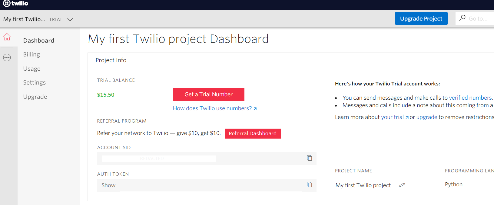

## How to send SMS messages using Twilio from a command line.
<br>
Send SMS messages from a command line. Useful for scripts and notifications to text yourself for free. If you want to be able to send SMS to other people, you will need to upgrade your account.
<br>

1. Go to Twilio.com or use my referral code: [www.twilio.com/referral/oQb7iV](www.twilio.com/referral/oQb7iV)

2. Sign up.

3. You will need to verify an email.

4. Next you will need to verify a phone #.

**For the first trial you will receive $15.50 to use for testing as of 6/19/2020.**

You can see this on your Twilio dashboard:



**Important:** You need to click on "Get a Trial Number" and use that as your "from" # in your scripts

Now that you have an account and some credit let's build a quick script that sends a text.

**Linux Bash**:

In Linux, we can use a quick curl request to send a message.

Create a file:

`nano sendsms.sh`

use the following template:
Replace the Auth Token, the From and To phone numbers.
<br>
``` bash
#!/bin/bash

message="$@"
curl -X POST https://api.twilio.com/2010-04-01/Accounts/ACcd390961d2822915c128dd88a192597c/Messages.json \
--data-urlencode "Body=$message" \
--data-urlencode "From=+10000000000" \
--data-urlencode "To=+17777777777" \
-u ACcd390961d2822915c128dd88a192597c:EnterYourAuthTokenHere
```

Now make your script executable:

`chmod +x sendsms.sh`

Now you can call your script from anywhere by using the following syntax:

`./sendsms.sh your message here`

For example notify yourself an nmap scan is done:

`nmap -sT -p80 192.168.1.0/24 | ./sendsms.sh $(grep --line-buffered 'Nmap done')`

**Windows Powershell:**

I'm modifying this template a little bit: <b>[https://www.twilio.com/docs/usage/tutorials/how-to-make-http-basic-request-twilio-powershell](https://www.twilio.com/docs/usage/tutorials/how-to-make-http-basic-request-twilio-powershell)</b>

I want to be able to call the script with my message like this: `.\sendsms.ps1 HELLO WORLD`
<br>
``` powershell
$sid = "ACcd390961d2822915c128dd88a192597c"     #your sid goes here
$token = "00000000000000000000000000000000"     #your token goes here
$number = "+19090000000"    # your twilio number
$recipient = "+12140000000" # your confirmed number
$message = $args -join " "
# Twilio API endpoint and POST params
$url = "https://api.twilio.com/2010-04-01/Accounts/$sid/Messages.json"
$params = @{ To = $recipient; From = $number; Body = $message }

# Create a credential object for HTTP basic auth
$p = $token | ConvertTo-SecureString -asPlainText -Force
$credential = New-Object System.Management.Automation.PSCredential($sid, $p)

# Make API request, selecting JSON properties from response
Invoke-WebRequest $url -Method Post -Credential $credential -Body $params -UseBasicParsing |
ConvertFrom-Json | Select sid, body
```
<br>
Save your script as sendsms.ps1

You can call it from a scheduled task etc. as follows:

`powershell.exe -ep Bypass .\sendsms.ps1 HELLO WORLD`

For Twilio's official tutorial and other templates for python, ruby, etc. go here: [https://www.twilio.com/docs/sms/send-messages](https://www.twilio.com/docs/sms/send-messages)

<br>
<br>
