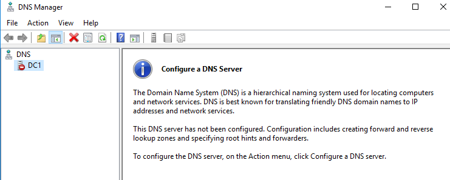

## How to fix a domain controller after running a Zerologon POC (CVE-2020-1472).
 
Running any POC's designed for exploiting CVE-2020-1472 AKA Zerologon breaks the domain controller unless you run the impacket tool or find a python script to reset the DC's computer password to its original one.

But what if you patched or can't run impacket, etc?

To fix your DC and bring it back from the broken state, The DC's computer account has to be reset in AD.

Run this command **twice** directly from the broken DC:

`netdom resetpwd /server:localhost /userD:administrator /passwordd:*`

You will be prompted for the administrator password.

**Because DNS is broken on this DC, using the actual name won't work, so we use localhost.**

We are using netdom as specified by Microsoft here [https://docs.microsoft.com/en-us/windows-server/identity/ad-ds/manage/ad-forest-recovery-reset-computer-account-dc][e7ea71ff]

  [e7ea71ff]: https://docs.microsoft.com/en-us/windows-server/identity/ad-ds/manage/ad-forest-recovery-reset-computer-account-dc "Reset DC's computer account in AD."

If you run `repadmin /replsum` you should get a clean result:

Read more about Zerologon here:
[https://www.secura.com/blog/zero-logon][91bf1783]

  [91bf1783]: https://www.secura.com/blog/zero-logon "Zerologon"

**Things that broke after running a Zerologon POC exploit:**

The first thing I noticed was the server stopped processing DNS requests.

Running `repadmin /replsum` showed Access is denied.:

There were a few interesting events logged:

**Event ID 2092:** This server is the owner of the following FSMO role, but does not consider it valid. For the partition which contains the FSMO, this server has not replicated successfully with any of its partners since this server has been restarted. Replication errors are preventing validation of this role...

Also **Event ID 5805** showed multiple times.

The attack was detected by ATA but it also broke it because I was running the gateway on the same server. This is a lab environment.

